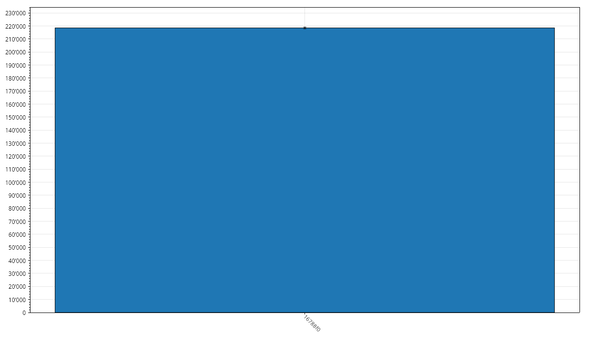
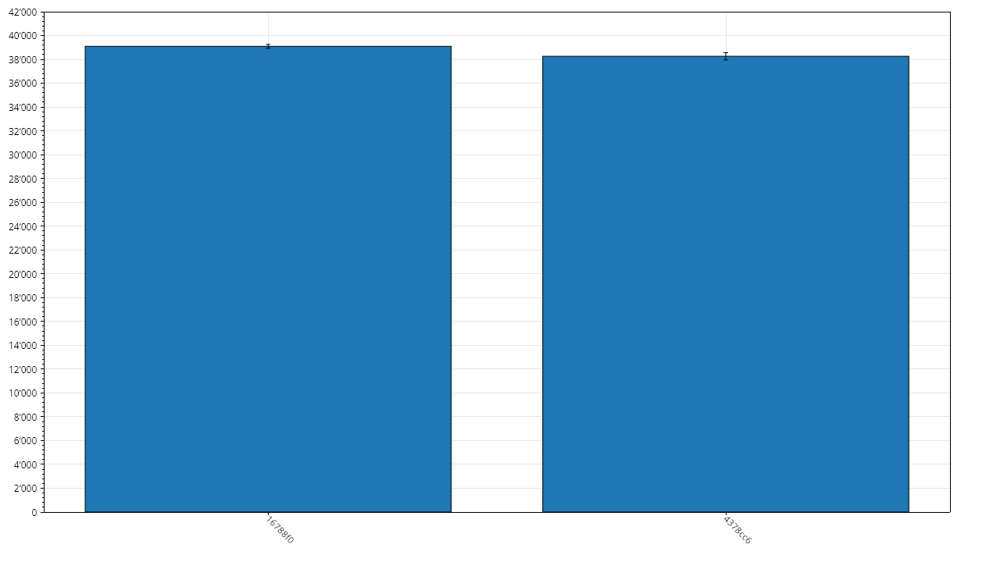
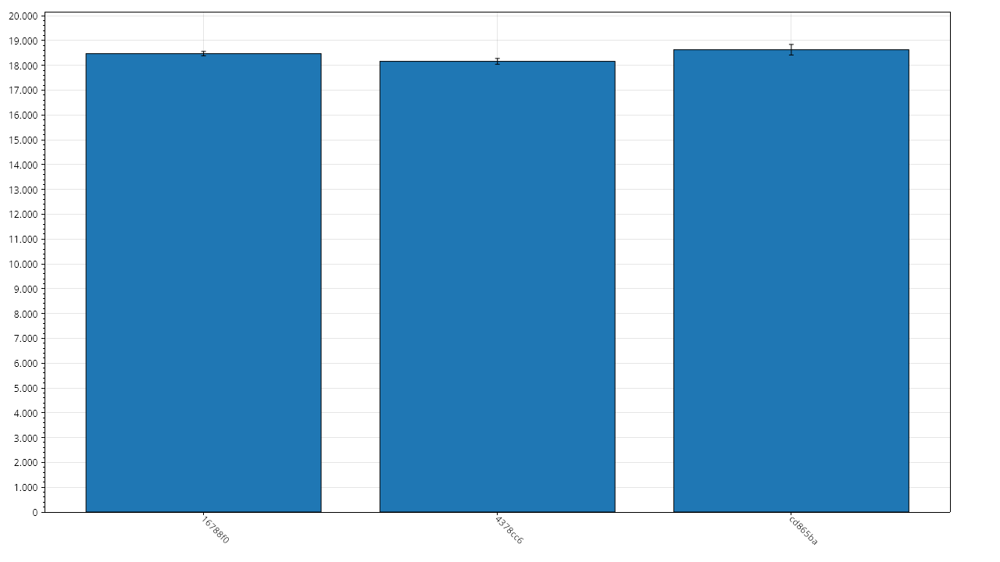
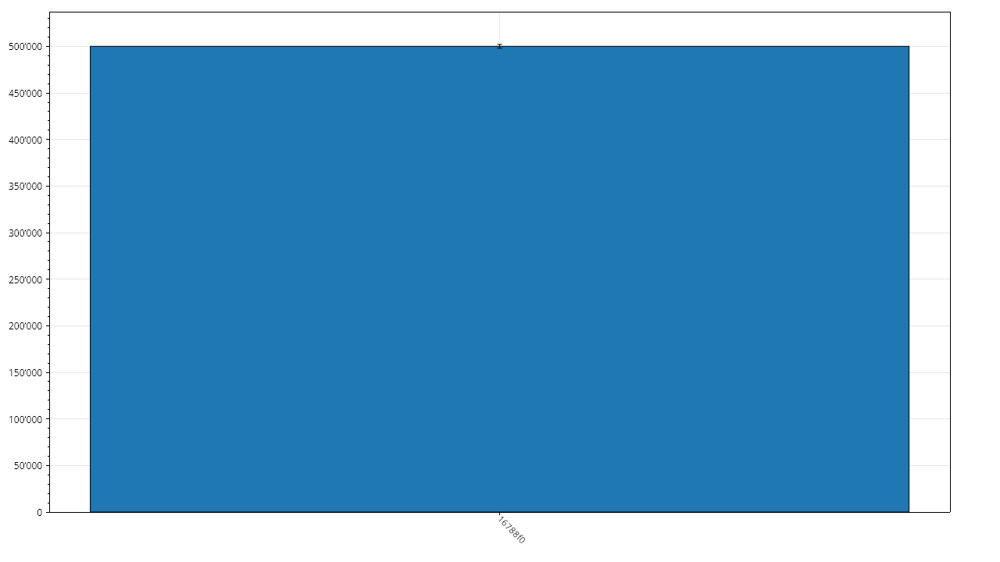

# InterpreterBench Results

## Metadata

- Git Commit: [16788f0](https://github.com/xXrederXx/YSharp/commit/16788f08154d605bbf2da0ecc504b50fc399c393)
- Recorded At: 31.12.2025 17:01:02

## Results

| Method                 | Time Mean  | Aprox. Error | Allocated | Gen 0 | Gen 1 | Gen 2 |
| ---------------------- | ---------- | ------------ | --------- | ----- | ----- | ----- |
| InterpreterBenchmarkL  | 218,537 ns | 609 ns       | 989 kb    | 118   | 43    | 0     |
| InterpreterBenchmarkM  | 39,095 ns  | 158 ns       | 198 kb    | 24    | 4     | 0     |
| InterpreterBenchmarkS  | 18,474 ns  | 89 ns        | 98 kb     | 12    | 1     | 0     |
| InterpreterBenchmarkXL | 500,077 ns | 2,009 ns     | 1,977 kb  | 236   | 127   | 0     |

## History

### InterpreterBenchmarkL

### InterpreterBenchmarkM

### InterpreterBenchmarkS

### InterpreterBenchmarkXL

