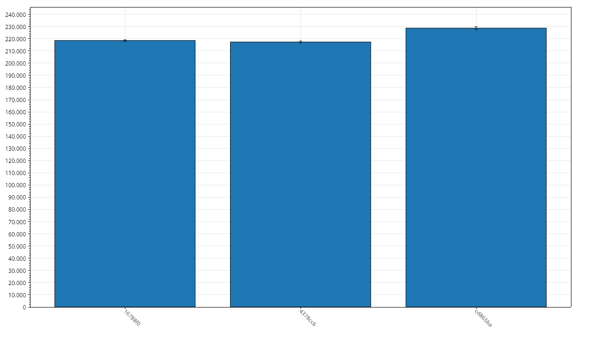
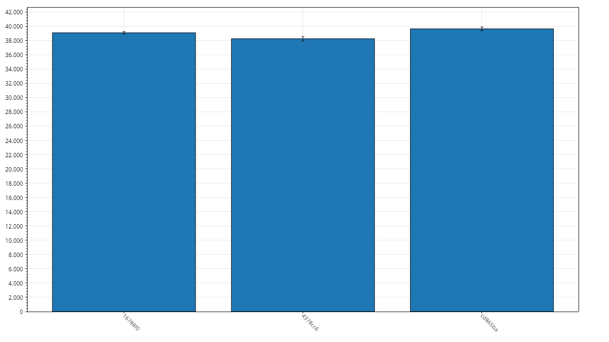
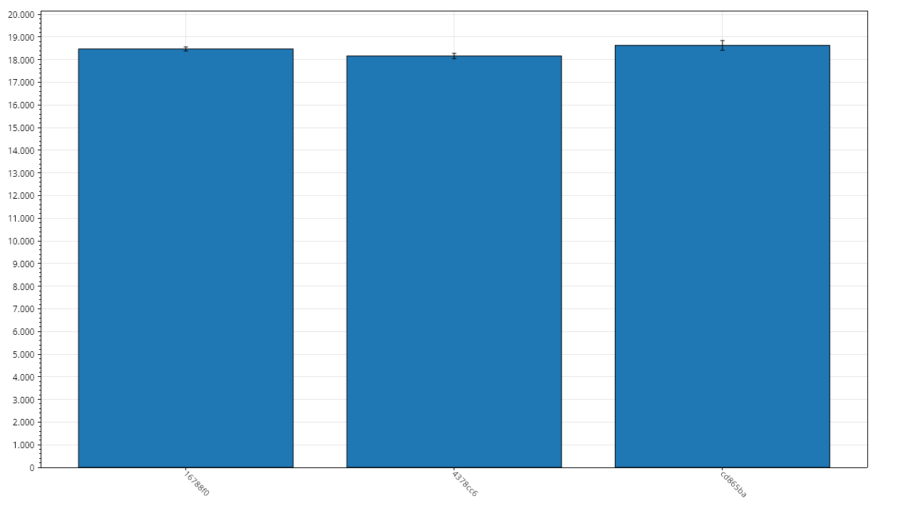
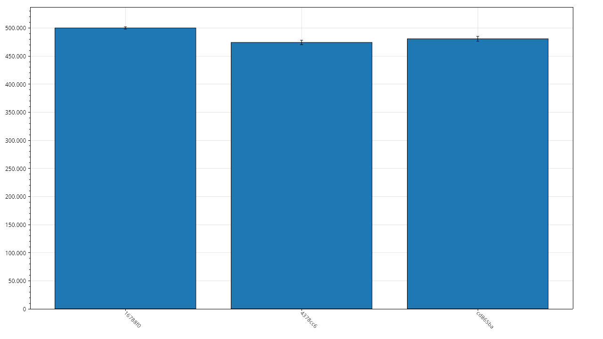

# InterpreterBench Results

## Metadata

- Git Commit: [cd865ba](https://github.com/xXrederXx/YSharp/commit/cd865ba938b7cfc6377e7c4fed9f94705ff50ffb)
- Recorded At: 15.03.2026 12:01:04

## Results

| Method                 | Time Mean  | Aprox. Error | Allocated | Gen 0 | Gen 1 | Gen 2 |
| ---------------------- | ---------- | ------------ | --------- | ----- | ----- | ----- |
| InterpreterBenchmarkL  | 228,717 ns | 1,184 ns     | 989 kb    | 118   | 43    | 0     |
| InterpreterBenchmarkM  | 39,646 ns  | 250 ns       | 198 kb    | 24    | 4     | 0     |
| InterpreterBenchmarkS  | 18,631 ns  | 214 ns       | 98 kb     | 12    | 1     | 0     |
| InterpreterBenchmarkXL | 480,778 ns | 4,355 ns     | 1,977 kb  | 236   | 127   | 0     |

## History

### InterpreterBenchmarkL

### InterpreterBenchmarkM

### InterpreterBenchmarkS

### InterpreterBenchmarkXL

