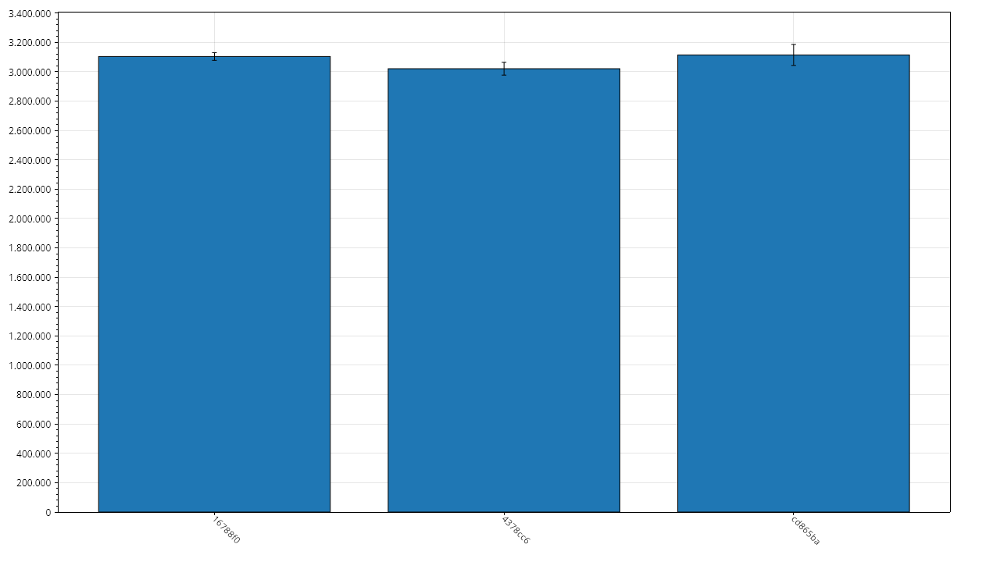
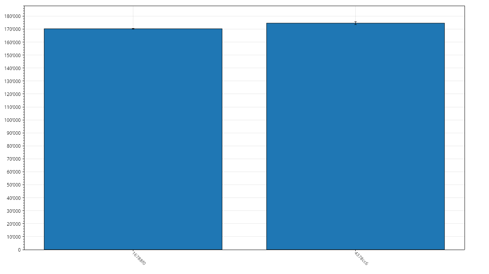
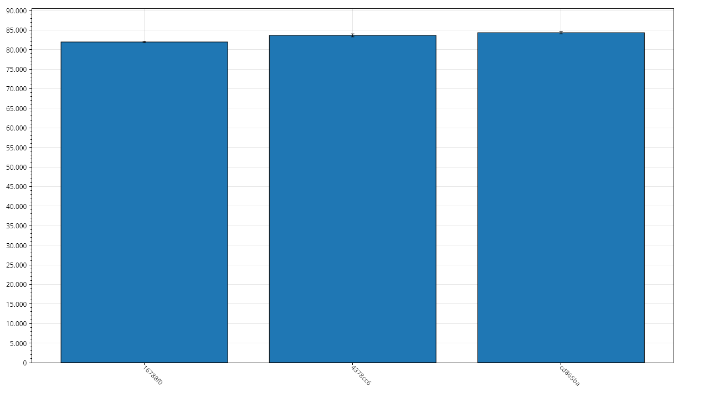
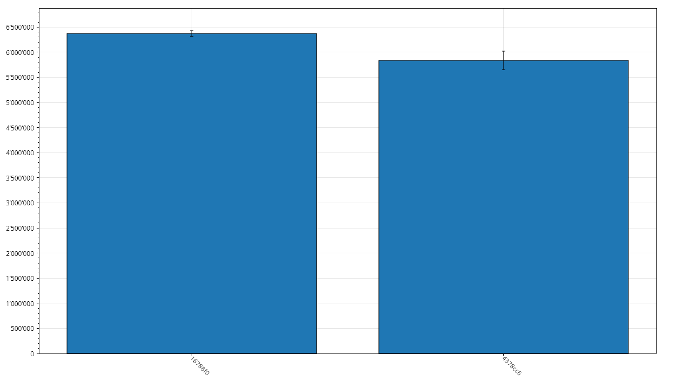

# LexerBench Results

## Metadata

- Git Commit: [16788f0](https://github.com/xXrederXx/YSharp/commit/16788f08154d605bbf2da0ecc504b50fc399c393)
- Recorded At: 31.12.2025 17:01:02

## Results

| Method           | Time Mean    | Aprox. Error | Allocated | Gen 0 | Gen 1 | Gen 2 |
| ---------------- | ------------ | ------------ | --------- | ----- | ----- | ----- |
| LexerBenchmarkL  | 3,103,993 ns | 26,343 ns    | 2,148 kb  | 293   | 289   | 86    |
| LexerBenchmarkM  | 170,284 ns   | 268 ns       | 458 kb    | 54    | 18    | 0     |
| LexerBenchmarkS  | 81,934 ns    | 147 ns       | 229 kb    | 27    | 7     | 0     |
| LexerBenchmarkXL | 6,373,498 ns | 55,702 ns    | 4,293 kb  | 578   | 570   | 180   |

## History

### LexerBenchmarkL

### LexerBenchmarkM

### LexerBenchmarkS

### LexerBenchmarkXL

