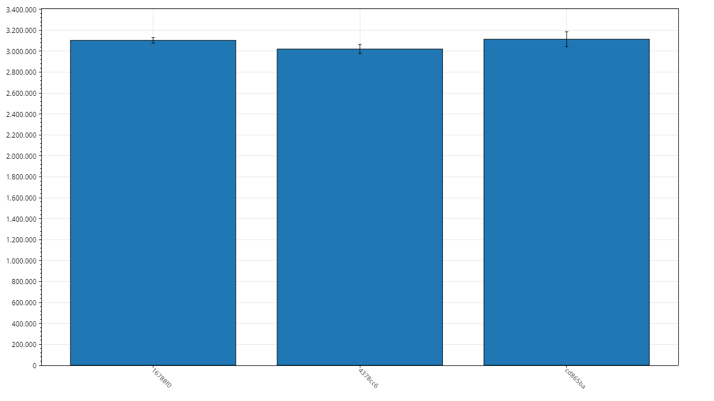
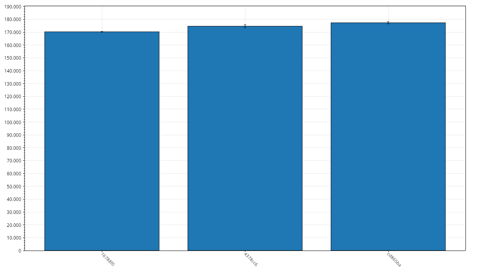
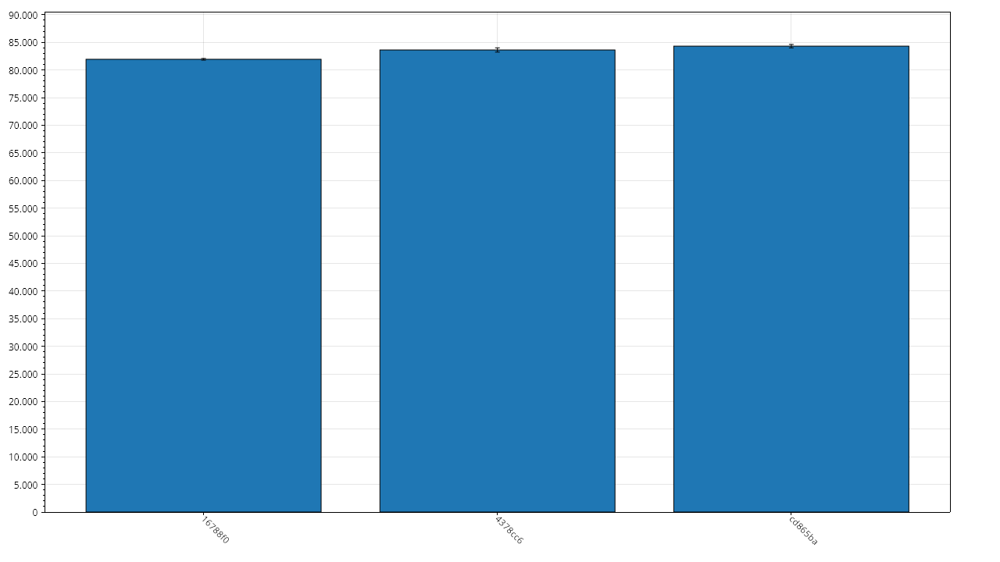
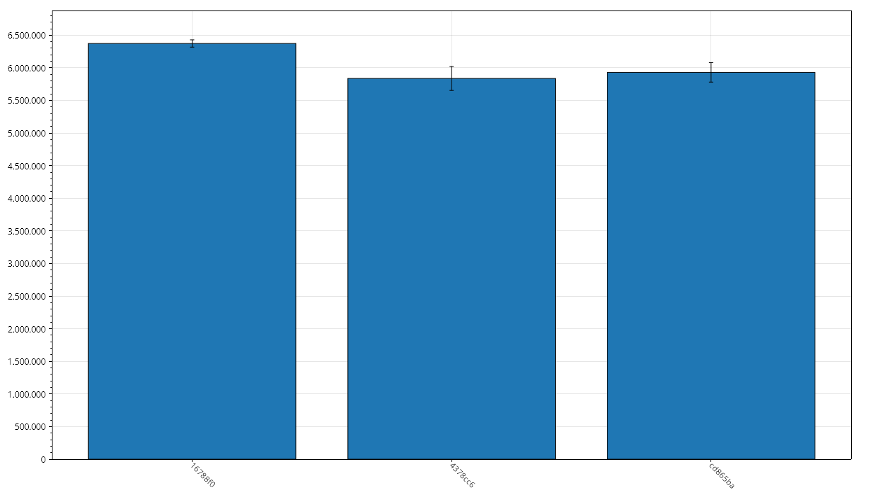

# LexerBench Results

## Metadata

- Git Commit: [cd865ba](https://github.com/xXrederXx/YSharp/commit/cd865ba938b7cfc6377e7c4fed9f94705ff50ffb)
- Recorded At: 15.03.2026 12:01:04

## Results

| Method           | Time Mean    | Aprox. Error | Allocated | Gen 0 | Gen 1 | Gen 2 |
| ---------------- | ------------ | ------------ | --------- | ----- | ----- | ----- |
| LexerBenchmarkL  | 3,114,712 ns | 71,474 ns    | 2,148 kb  | 301   | 297   | 94    |
| LexerBenchmarkM  | 177,297 ns   | 783 ns       | 458 kb    | 54    | 36    | 0     |
| LexerBenchmarkS  | 84,313 ns    | 307 ns       | 229 kb    | 27    | 10    | 0     |
| LexerBenchmarkXL | 5,930,572 ns | 149,159 ns   | 4,293 kb  | 586   | 578   | 188   |

## History

### LexerBenchmarkL

### LexerBenchmarkM

### LexerBenchmarkS

### LexerBenchmarkXL

