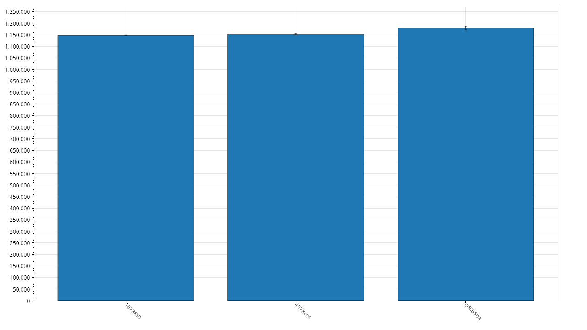
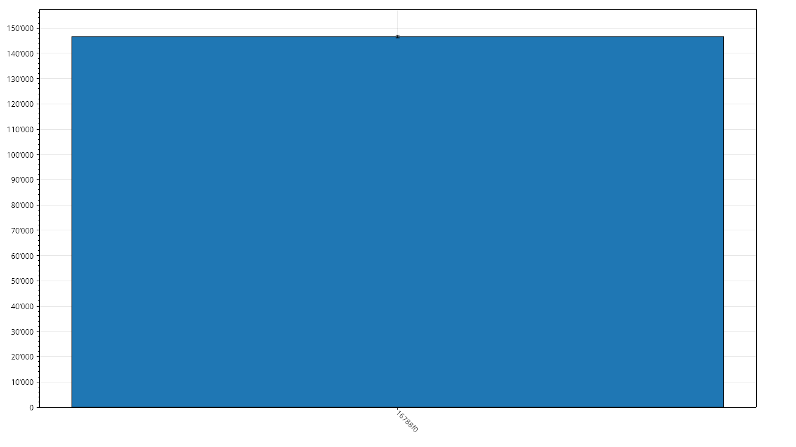
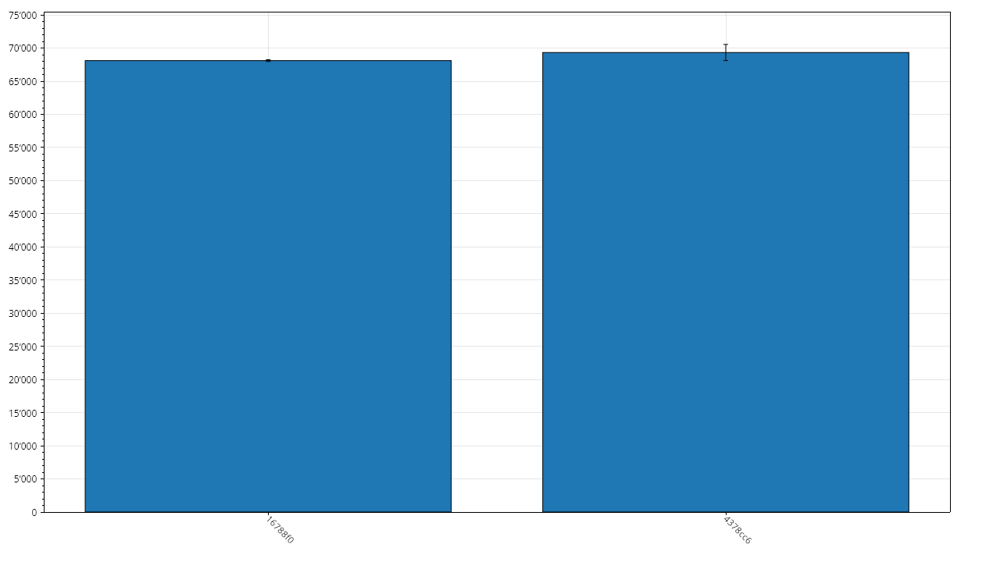
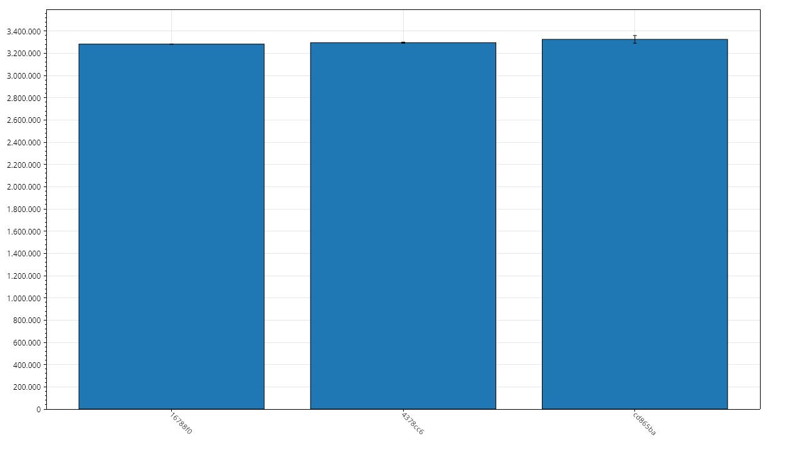

# ParserBench Results

## Metadata

- Git Commit: [4378cc6](https://github.com/xXrederXx/YSharp/commit/4378cc6bbdd7e216fbbf46590e863b5dfc89a964)
- Recorded At: 03.01.2026 17:26:23

## Results

| Method            | Time Mean    | Aprox. Error | Allocated | Gen 0 | Gen 1 | Gen 2 |
| ----------------- | ------------ | ------------ | --------- | ----- | ----- | ----- |
| ParserBenchmarkL  | 1,152,948 ns | 3,267 ns     | 4,048 kb  | 492   | 268   | 35    |
| ParserBenchmarkM  | 156,564 ns   | 5,340 ns     | 810 kb    | 97    | 32    | 0     |
| ParserBenchmarkS  | 69,330 ns    | 1,217 ns     | 400 kb    | 48    | 11    | 0     |
| ParserBenchmarkXL | 3,294,876 ns | 5,636 ns     | 8,095 kb  | 984   | 754   | 70    |

## History

### ParserBenchmarkL

### ParserBenchmarkM

### ParserBenchmarkS

### ParserBenchmarkXL

