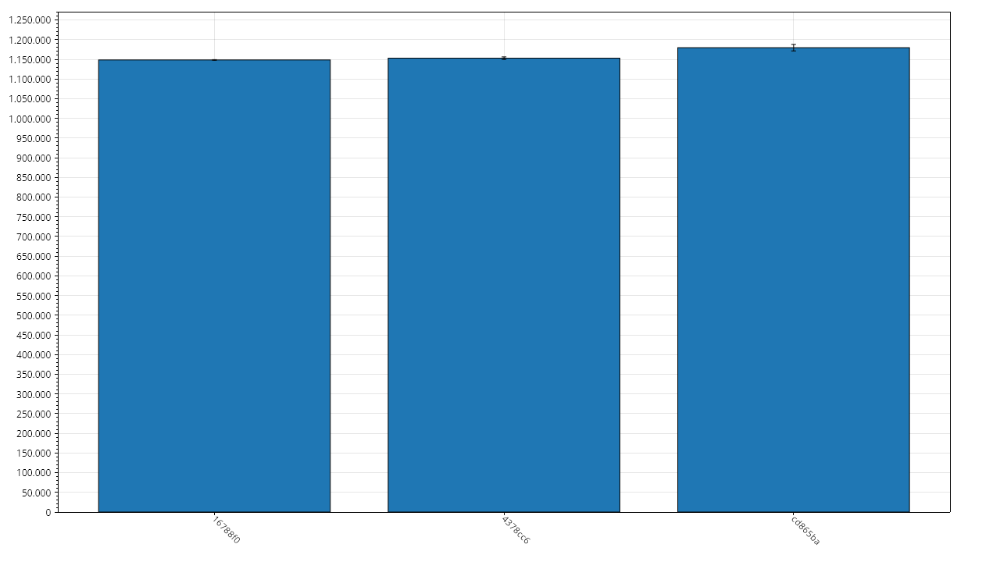
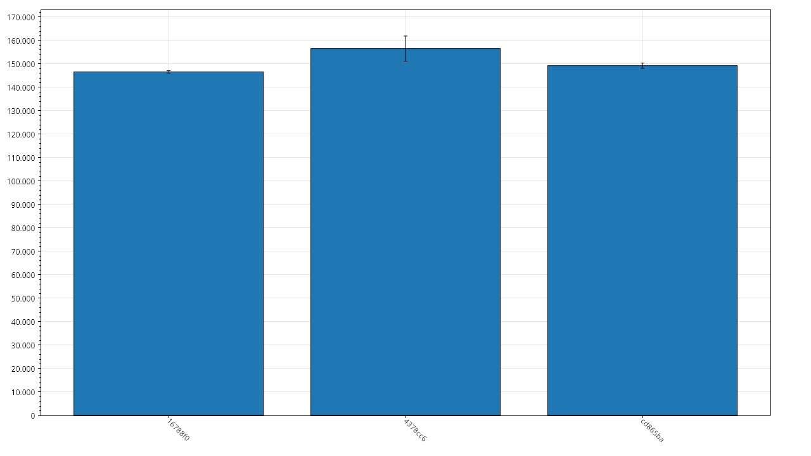
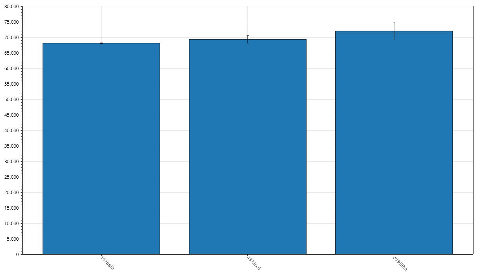
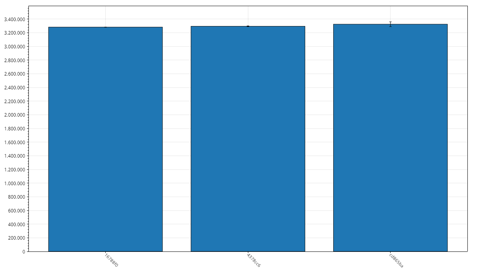

# ParserBench Results

## Metadata

- Git Commit: [cd865ba](https://github.com/xXrederXx/YSharp/commit/cd865ba938b7cfc6377e7c4fed9f94705ff50ffb)
- Recorded At: 15.03.2026 12:01:04

## Results

| Method            | Time Mean    | Aprox. Error | Allocated | Gen 0 | Gen 1 | Gen 2 |
| ----------------- | ------------ | ------------ | --------- | ----- | ----- | ----- |
| ParserBenchmarkL  | 1,179,612 ns | 8,216 ns     | 4,048 kb  | 492   | 268   | 35    |
| ParserBenchmarkM  | 149,264 ns   | 1,119 ns     | 810 kb    | 97    | 32    | 0     |
| ParserBenchmarkS  | 72,006 ns    | 2,915 ns     | 400 kb    | 48    | 11    | 0     |
| ParserBenchmarkXL | 3,325,028 ns | 34,532 ns    | 8,095 kb  | 984   | 754   | 70    |

## History

### ParserBenchmarkL

### ParserBenchmarkM

### ParserBenchmarkS

### ParserBenchmarkXL

