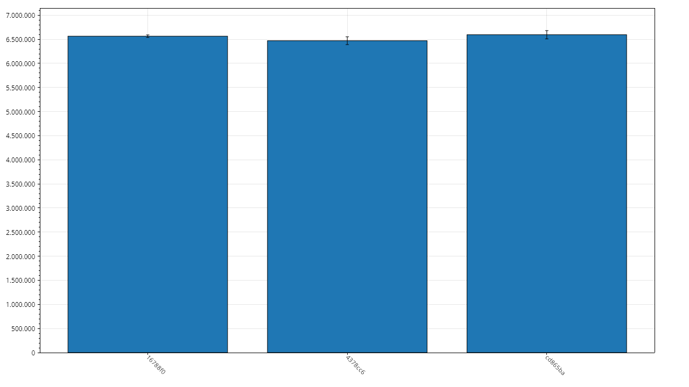
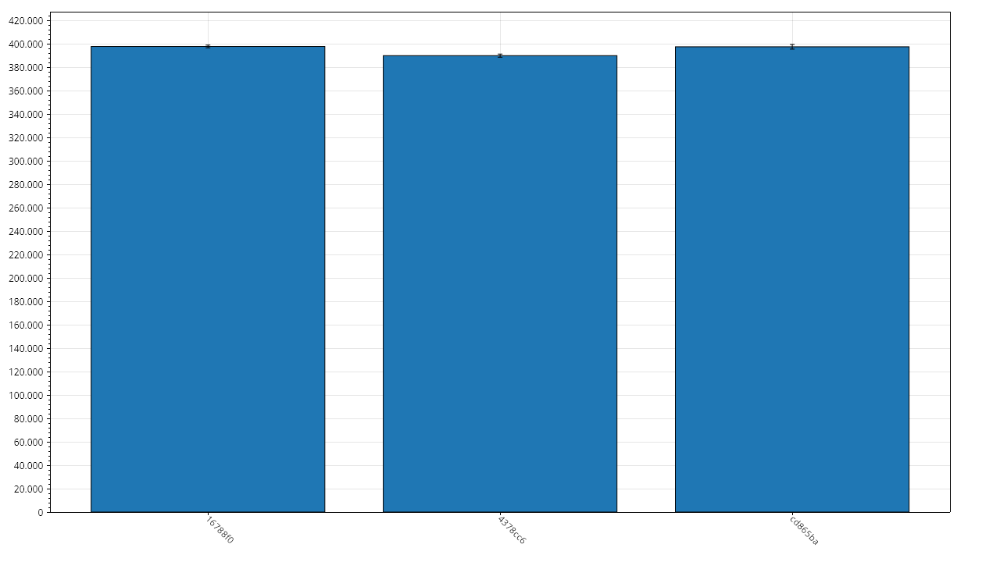
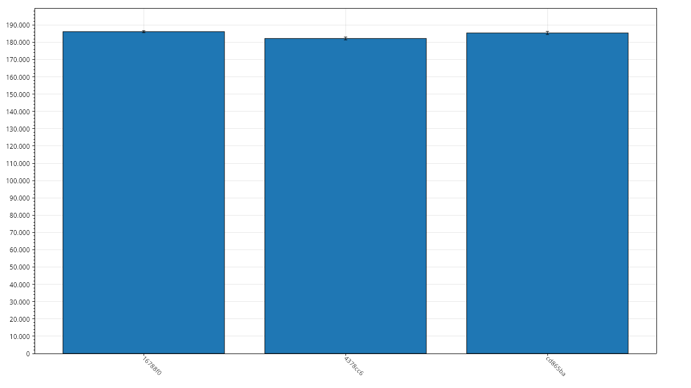
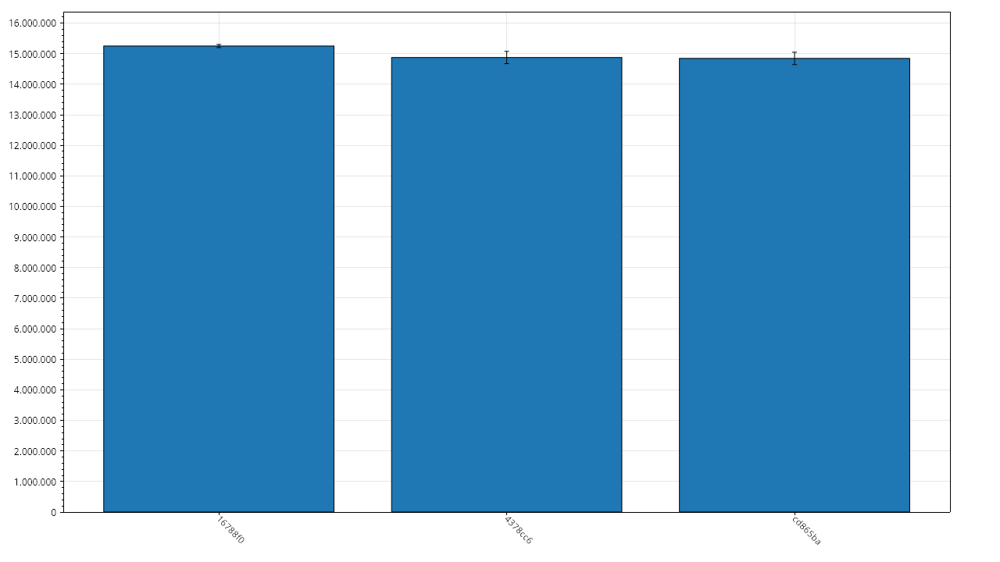

# RunTimeBench Results

## Metadata

- Git Commit: [4378cc6](https://github.com/xXrederXx/YSharp/commit/4378cc6bbdd7e216fbbf46590e863b5dfc89a964)
- Recorded At: 03.01.2026 17:26:23

## Results

| Method        | Time Mean     | Aprox. Error | Allocated | Gen 0 | Gen 1 | Gen 2 |
| ------------- | ------------- | ------------ | --------- | ----- | ----- | ----- |
| RTBenchmarkL  | 6,470,974 ns  | 80,859 ns    | 7,186 kb  | 914   | 398   | 133   |
| RTBenchmarkM  | 389,920 ns    | 1,351 ns     | 1,465 kb  | 175   | 75    | 0     |
| RTBenchmarkS  | 182,210 ns    | 820 ns       | 727 kb    | 87    | 31    | 0     |
| RTBenchmarkXL | 14,872,096 ns | 200,686 ns   | 14,365 kb | 1,828 | 844   | 281   |

## History

### RTBenchmarkL

### RTBenchmarkM

### RTBenchmarkS

### RTBenchmarkXL

