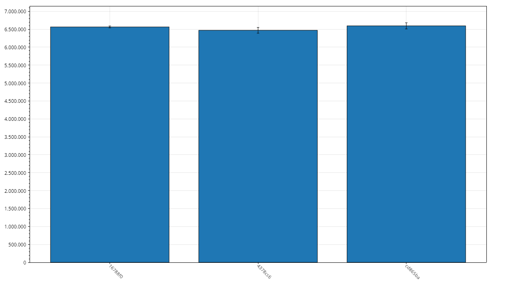
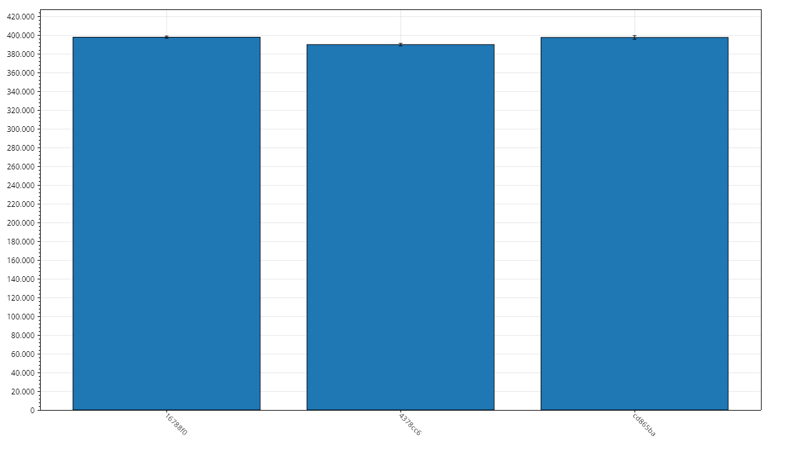
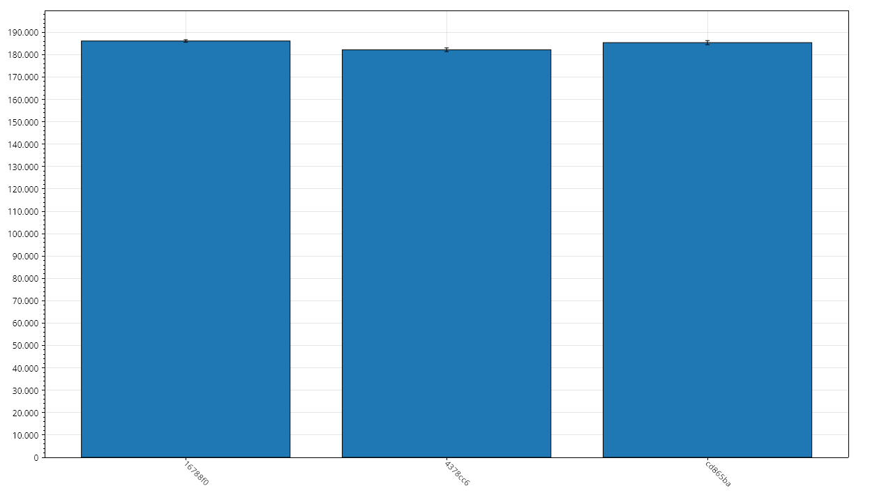
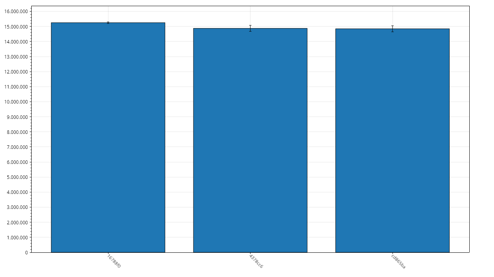

# RunTimeBench Results

## Metadata

- Git Commit: [cd865ba](https://github.com/xXrederXx/YSharp/commit/cd865ba938b7cfc6377e7c4fed9f94705ff50ffb)
- Recorded At: 15.03.2026 12:01:04

## Results

| Method        | Time Mean     | Aprox. Error | Allocated | Gen 0 | Gen 1 | Gen 2 |
| ------------- | ------------- | ------------ | --------- | ----- | ----- | ----- |
| RTBenchmarkL  | 6,594,989 ns  | 85,599 ns    | 7,186 kb  | 914   | 398   | 133   |
| RTBenchmarkM  | 397,494 ns    | 1,998 ns     | 1,465 kb  | 175   | 75    | 0     |
| RTBenchmarkS  | 185,399 ns    | 904 ns       | 727 kb    | 87    | 31    | 0     |
| RTBenchmarkXL | 14,843,313 ns | 202,380 ns   | 14,365 kb | 1,828 | 844   | 281   |

## History

### RTBenchmarkL

### RTBenchmarkM

### RTBenchmarkS

### RTBenchmarkXL

